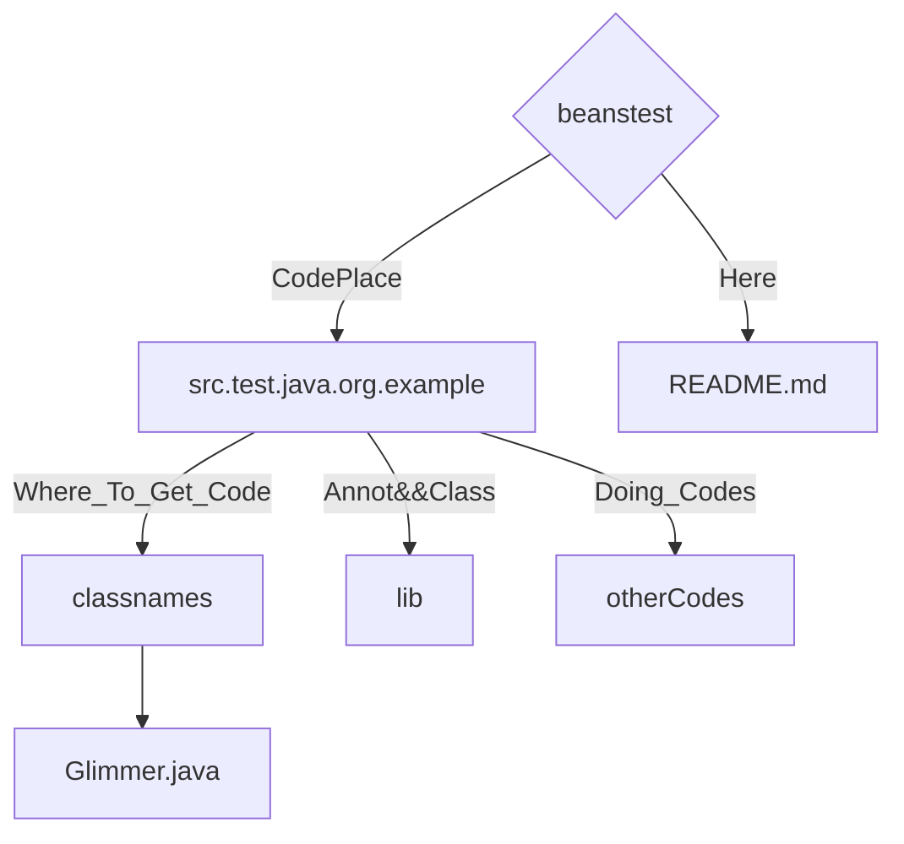
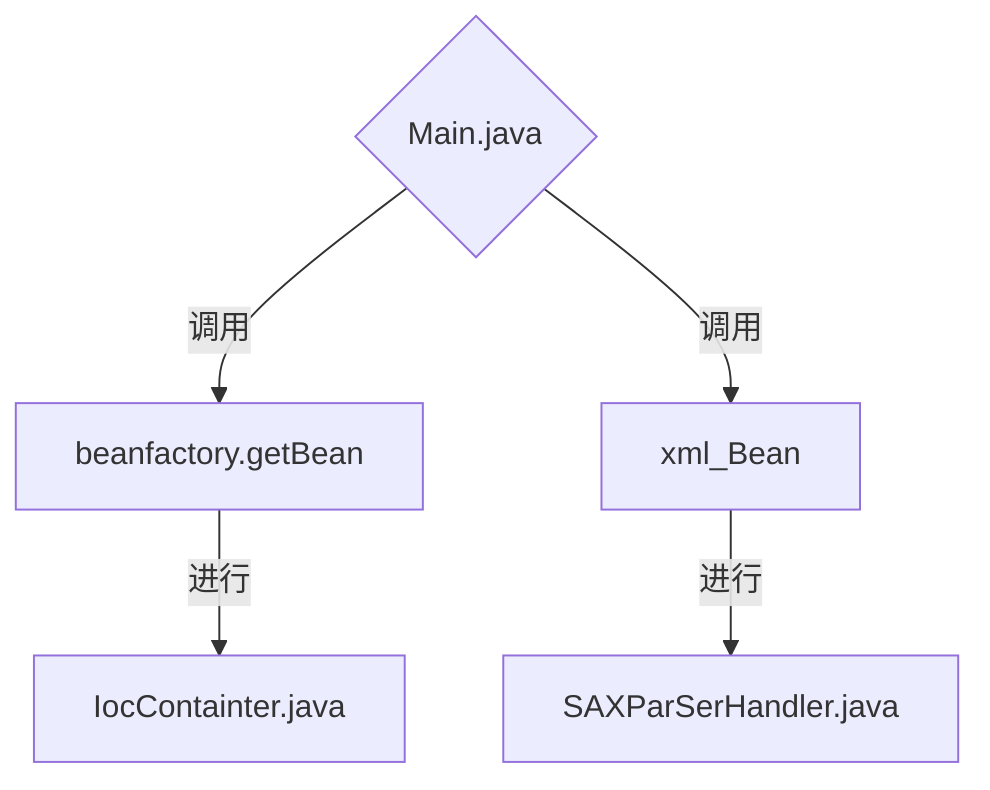

# 文件说明

## Should_Know 
本文件夹的beanstest是可以直接访问的，但是需要使用intellj，因为这个要导入maven/哭泣/

## Table_Structure

## Done_Phrase
- 1. TASK3 
     - 1. 首先我进行IocContainter.java，先使用loadComponent获得文件的位置和类型，便于以后装配，也就是将Glimmer.java进行扫描（里面放一些别的文件也可以扫描。），扫描我使用的是文件名称数组加递归，然后将文件位置拼出来。这里面因为只有一个文件，所以情况得到了简化。可以说，除了assembly函数，其他的函数都在进行文件位置类型的拼装。
     - 2. assembly是使用装配，返回值的过程，我通过调用invoke获得返回值，然后传出函数，但是奇怪的是他只能输出字节码，我暂时没找到解决方案。
- 2. TASK4
     - 1. 读取文件我使用的是org.xml.Sax，这个库是自带库，但是他使用较为麻烦，对于他，识别proporty内的类，需要进行不断地循环。其他的和正常的TASK3也是十分相近的。

- 3. File_Structure_OtherCodes

## Tips

1. 如果要看6A TASK3,4题的代码，[点击这里](https://github.com/logwood/beanstest). 如果想了解结构，请移步beanstest文件夹readme.md文件